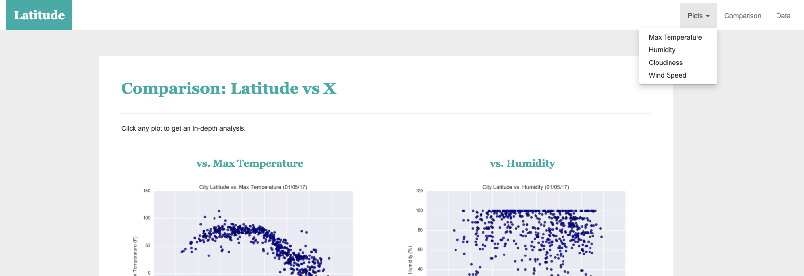

# Unit 11 Homework: Web Visualization Dashboard 

## Purpose of Web Visualization Dashboard Activity

This activity demonstrates what knowledge I have obtained from learning HTML and CSS and I have generated a dashboard featuring the a weather analysis that compared a location's latitude with the maximum temperature, humidity, cloudiness, and wind speed, respectively, in the area, as captured in the following image:

  

## Navigation Instructions

Individual pages for each plot and a way to navigate between them was created. These pages will contain the visualizations and descriptions. A landing page was also developed to provide a comparison of all the plots, along with another page to present the data used to build them.

### Website Requirements

For reference, review the following ["Screenshots" section](#screenshots). 

The website consists of seven pages in total, including:

* A [landing page](#landing-page) containing the following elements:

  * An explanation of the project

  * Links to each visualizations page. There is a sidebar containing preview images of each plot. Clicking an image should take the user to that visualization.

* Four [visualization pages](#visualization-pages), stored in the `visualizations` folder, each with the following elements:

  * A title and heading tag.

  * The plot or visualization for the selected comparison (latitude vs: max temperature, humidity, cloudiness, or wind speed).

  * A paragraph describing the plot and its significance.

* A ["Comparisons" page](#comparisons-page) that does the following:

  * Contains all of the visualizations on the same page so they can easily be compared with each other.

  * Uses a Bootstrap grid for the visualizations.

* A ["Data" page](#data-page) that displays a responsive table containing the data used in the visualizations.

### Screenshots

This section contains screenshots of each page that were built, at varying screen widths.

#### Landing page

Large screen:

Small screen:



#### Comparisons page

Large screen:

Small screen:

#### Data page

Large screen:

Small screen:

#### Visualization pages

Four visualizations were built. Here's an example of one visualization page on two different screen sizes:

Large screen:

Small screen:

#### Navigation menu

Large screen:

Small screen:

- - -

## References

OpenWeatherMap.org. (2012). Сurrent weather and forecast. Retrieved from [https://openweathermap.org/](https://openweathermap.org/)

- - -

© 2022 Trilogy Education Services, a 2U, Inc. brand. All Rights Reserved.

